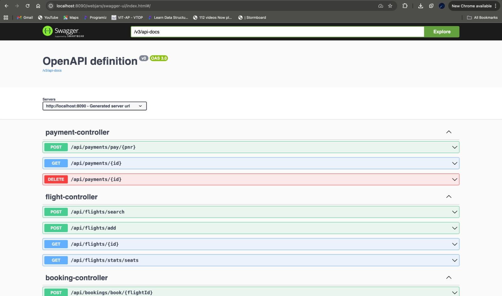
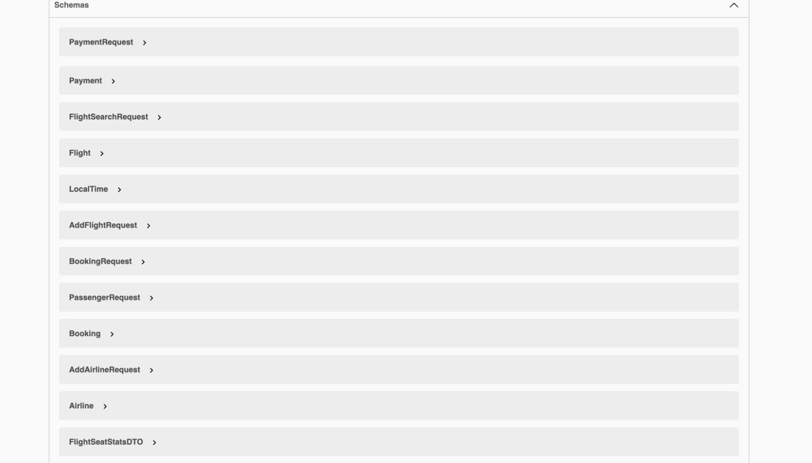
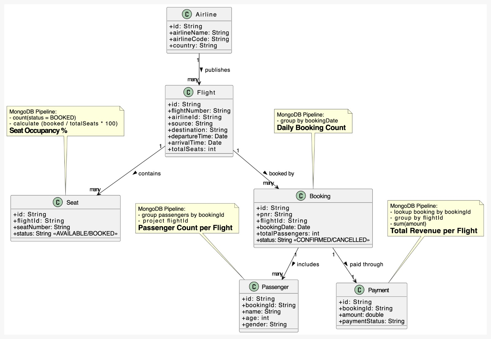

#  FLIGHT BOOKING SYSTEM

This Flight Booking System built using **Spring WebFlux + Reactive MongoDB** provides a fully reactive, non-blocking architecture with rich functionality:

##  Core Functionalities

### 🛫 **Airline Management**
- Add new airlines  
- Fetch airline by code  
- View all airlines  
- Delete airline by ID  

###  **Flight Management**
- Add new flights  
- Search flights by **fromPlace + toPlace + flightDate**  
- View flight by ID  
- Supports real-time seat availability  

###  **Seat Management**
- Seat distribution per flight  
- Seat status: `AVAILABLE`, `BOOKED`, `BLOCKED`  
- Seat-level verification before booking

###  **Booking Management**
- Create booking for a flight  
- Retrieve booking by PNR  
- Delete or cancel booking  
- Includes passenger details for each booking  

###  **Payment Processing**
- Pay using PNR  
- Fetch payment details by payment ID  
- Delete payment  
- One-to-one relationship with booking  

---

##  Aggregation Pipelines (MongoDB)
The project demonstrates real-world analytics using MongoDB pipelines:

- ✔️ **Total Revenue per Flight**  
- ✔️ **Passenger Count per Flight**  
- ✔️ **Daily Booking Count**  
- ✔️ **Seats Booked per Flight**  
- ✔️ **Remaining Seats per Flight**  

These pipelines provide insights for airline operations and reporting dashboards.

---

##  System Characteristics

- Fully **Reactive** (WebFlux + Reactor)  
- **Non-blocking I/O** for maximum performance  
- **DTO + Request Models** for clean API contracts  
- **Global Exception Handling**  
- **Modular & Layered Architecture**  
- 95%+ of operations implemented with **Mono / Flux**  
- Clean **Maven-based project structure**  
- Ready for deployment and scaling  

---

##  Swagger UI Previews

### **Swagger UI – Main View**

---

### **Swagger UI – Schemas View**

---

##  UML Diagram

### **Complete Class Diagram**

This UML diagram represents the overall architecture:

- Airline → Flight (One-to-Many)  
- Flight → Seats (One-to-Many)  
- Booking → Passenger (One-to-Many)  
- Booking → Payment (One-to-One)  
- Includes all Reactive Services + Repositories  
- Includes Aggregation Pipelines

---
